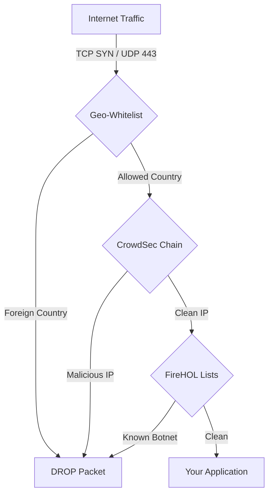

# FireHOL Update-IPSets (Docker) + Geo-Gatekeeper


## Introduction
This is a Docker image designed to secure your Linux server by orchestrating the host's `iptables` firewall. It acts as an automated threat shield that:
1.  **Blocks malicious IPs** using auto-updated FireHOL blacklists.
2.  **Enforces Geo-Whitelisting**, allowing TCP connections only from specific countries.
3.  **Protects Dual-Stack** environments (IPv4 and IPv6).

It runs as a sidecar container, injecting rules dynamically while leaving your existing Docker or SSH configuration intact.

## Features
* **Threat Intelligence:** Automatically downloads hundreds of blocklists (Spamhaus, DShield, BotScout, etc.).
* **Geo-Gatekeeper:** High-performance blocking of foreign traffic at the kernel level (`ipset`).
* **Performance:** Handles millions of blocked IPs with negligible CPU impact (O(1) complexity).
* **Dual-Stack:** Parallel protection for `iptables` (IPv4) and `ip6tables` (IPv6).
* **CrowdSec Friendly:** Designed to run alongside CrowdSec; hooks into `DOCKER-USER` without conflict.
* **Smart Bypass:** Automatically trusts Localhost, LAN (RFC1918), and Docker internal networks.
* **Secure:** Runs as non-root (UID 6721) with minimal capabilities (`NET_ADMIN`).

## Architecture & Traffic Flow
The container hooks into the `INPUT` (Host) and `DOCKER-USER` (Containers) chains.



## Prerequisites
Since this container manipulates the host kernel, ensure your host has the necessary modules:
1.  **Docker** installed.
2.  **Kernel Modules:** The host kernel must support `ipset`. Most standard Linux distros (Ubuntu, Debian, CentOS) have this enabled by default.
    ```bash
    # Test if ipset is working on host
    sudo ipset list
    ```

## Installation & Usage

### 1. Prepare Data Directory (Crucial!)
The container runs as a non-root user (UID **6721**). You must create the data directory and assign the correct permissions **before** starting the container, or it will crash.

```bash
mkdir -p ./firehol-data
sudo chown -R 6721:6721 ./firehol-data
```

### 2. Docker Compose
Create a `docker-compose.yml`:

```yaml
services:
  firewall-guard:
    image: ghcr.io/verybadsoldier/docker-firehol-update-ipsets:latest
    container_name: firewall-guard
    network_mode: host
    cap_drop:
      - ALL
    cap_add:
      - NET_ADMIN
      - NET_RAW
    volumes:
      # Map the directory we created in Step 1
      - ./firehol-data:/etc/firehol/ipsets
    environment:
      - TZ=Europe/Berlin
      
      # --- Geo-Whitelist (The "Germany Only" Rule) ---
      - GEO_WHITELIST_ENABLED=true
      - GEO_WHITELIST_COUNTRIES=de at ch
      
      # --- Blocklist Config ---
      - FIREHOL_LISTS_INIT=firehol_level1 firehol_level2 botscout_30d
      - SKIP_LISTS=fullbogons greensnow
      
      # --- Whitelist (Bypass Everything) ---
      # Example: Admin Office IP, VPN Exit IP
      - WHITELIST_IPS=203.0.113.5 2001:db8::1
      
      # --- System ---
      - IPTABLES_CMD=iptables-nft
      - IP6TABLES_CMD=ip6tables-nft
      
    restart: unless-stopped
```

### 3. Deploy
```bash
docker-compose up -d
```

## Configuration Variables

| Variable | Description | Default |
| :--- | :--- | :--- |
| `GEO_WHITELIST_COUNTRIES` | Space-separated ISO codes allowed to initiate TCP connections. | `<empty>` |
| `GEO_WHITELIST_ENABLED` | Master switch for Geo-Blocking. Set `false` to disable. | `true` |
| `FIREHOL_LISTS_INIT` | Lists to activate on startup. | `firehol_level1 firehol_level2` |
| `WHITELIST_IPS` | IPs (v4/v6) that bypass **ALL** checks (Geo & Blacklists). | `<empty>` |
| `IPTABLES_CMD` | Backend command (`iptables` or `iptables-nft`). | `iptables` |
| `IP6TABLES_CMD` | Backend command (`iptables` or `iptables-nft`) for IPv6. | `ip6tables` |
| `SKIP_LISTS` | FireHOL lists to skip explicitly. | `<empty>` |

## How It Works

### The Geo-Gatekeeper
This feature significantly reduces noise and attack surface.
* **TCP:** Drops `SYN` packets from countries not in your whitelist. Scanners from China/Russia/USA (if not whitelisted) simply time out.
* **UDP:** Blocks UDP/443 (QUIC) from non-whitelisted countries to prevent HTTP/3 leaks.
* **Safety:** ICMP (Ping) and other UDP ports (DNS, Gaming) are **allowed** to prevent network breakage.

### FireHOL Blacklists
The container aggregates lists from [FireHOL](http://iplists.firehol.org/).
* `firehol_level1`: The most reliable lists (Spamhaus, DShield, etc.). ~100% safe to block.
* `firehol_level2`: Broader lists, includes anonymizers and partial attacks.
* `botscout_30d`: IPs that have acted as bots in the last 30 days.

### Runtime Rules
To verify the rules are active, use `iptables -nL` (the `-n` is important to avoid slow DNS lookups):

```bash
sudo iptables -nL FIREHOL_BLACKLIST
```

You should see a chain structure like this:
1.  **ACCEPT** Related/Established (Performance optimization)
2.  **TRUSTED_BYPASS** (Jumps to Localhost/LAN whitelist)
3.  **DROP** Geo-Mismatch (If source != DE/AT/CH)
4.  **DROP** Blacklists (firehol_level1, etc.)

## Troubleshooting

### "Permission Denied" errors in logs
You skipped **Step 1** of the installation. The container cannot write to the mapped volume.
Run: `sudo chown -R 6721:6721 ./your-data-dir`

### Container restarts constantly / "iptables: No chain/target/match"
Your host OS might not have the required kernel modules loaded, or you are using the wrong backend (`nft` vs `legacy`).
1.  Try switching `IPTABLES_CMD` to `iptables-legacy` (or vice versa).
2.  Ensure `ipset` is installed on the host.

### Support
* **Original Project:** [devrt/docker-firehol-update-ipsets](https://github.com/devrt/docker-firehol-update-ipsets)
* **Maintainer:** vbs <vbs@springrts.de>

Distributed under MIT license.